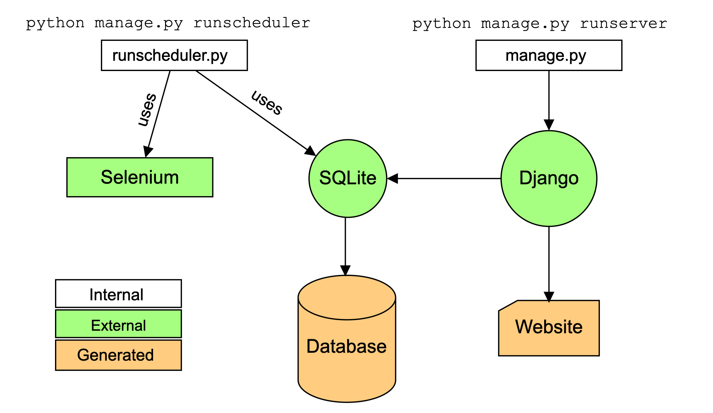

# TUM Library Reservation Tool

This app creates schedules to automatically reserve seats in the TUM library.
The user specifies which library branch he wants to study in and which dates and time slots are to be booked. 
The tool will wait until the correct reservation can be made and book it automatically. 
For this, the tool requires some configuration data from the user (full name, TUM email adress, etc.).

## Preview

The web app has four pages: the log-in, a profile page, plus the booking and schedule overview pages.

https://user-images.githubusercontent.com/45896065/148652661-4bfd9d86-747d-4af6-8563-ffda078b544e.mov

## How to use it

I hosted a live version of this tool over on [http://philippwulff.pythonanywhere.com/](http://philippwulff.pythonanywhere.com/).

You can also clone this repository and host it yourself. For this, you will need to following commands:
```
python manage.py migrate            # to create a new database
python manage.py createsuperuser    # to create the admin user
python manage.py runserver          # to start the website

# In another terminal window
python manage.py runscheduler       # to start the scheduling backend
```

> **⚠️ NOTE:** If you do reuse the project, you must change the Django secret key in `reservation_site/settings.py`.

### Hosting on Google Cloud Services

Plan: [Google Cloud Services](https://cloud.google.com/free/docs/gcp-free-tier#free-tier-usage-limits)

### Hosting on pythonanywhere.com

To host it on [pythonanywhere.com](https://www.pythonanywhere.com/) (PyA) you need to follow this check-list (from [this guide](https://help.pythonanywhere.com/pages/DeployExistingDjangoProject/)):
1. Create an account on PyA.
2. Open a Bash terminal on PyA and run
   ```
   git clone https://github.com/philippwulff/lib_reservation_tool.git
   cd lib_reservation_tool
   python manage.py migrate
   ```
3. Create a web app in the 'Web' widget of pythonanywhere (choose manual configuration).
4. In the 'Code' section set the path for 'Source code' to `/home/username/lib_reservation_tool/` (Your username!).
5. Edit the WSGI configuration file according to the guide linked above.
6. Serving static files in development to production.
   - In `settings.py` set `STATIC_URL` and `STATIC_ROOT` (I already did this and [this](https://help.pythonanywhere.com/pages/DjangoStaticFiles) explains how).
   - In the terminal run `python manage.py collectstatic`.
   - In the 'Static files' section of the configuration set 'URL' to `/static/` and 'Directory' to `/home/username/LibResTool/static`.   
7. Hit the reload button and navigate to the webpage!
8. Done.

## How it works

The tool opens the webpage at https://www.ub.tum.de/arbeitsplatz-reservieren, 
and waits until it is possible to reserve the desired seat. 
I use [Selenium](https://selenium-python.readthedocs.io) as the backbbone of this process. 
The frontend is powered by [Django](https://www.djangoproject.com). 
These two parts of the software are separate processes and communicate via a shared [SQLite](https://www.sqlite.org/index.html) database.
The image below shows this architecture:

<p align="center">
  
</p>


## Known issues

- Currently there is no "Sign up" page. Users need to be created through the admin site (this requires creating a `superuser` first).
- If the website of the TUM library is changed, the backend code may break. If the changes are small, this can probably be fixed by editing the CSS locators in `reservation_app/management/commands/common/locators.py`. 
- If you receive an exception message saying that no webdriver was found, `Selenium` could not locate the driver for your browser. You need to configure this in `reservation_app/management/commands/common/app.py`.

## Disclaimer

All commercial use of this software is prohibited.
