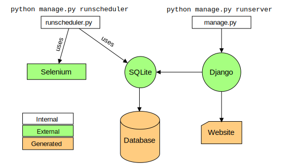

# TUM Library Reservation Tool

This app creates schedules to automatically reserve seats in the TUM library.
The user specifies which library branch he wants to study in and which dates and time slots are to be booked. 
The tool will wait until the correct reservation can be made and book it automatically. 
For this, the tool requires some configuration data from the user (full name, TUM email adress, etc.).

## Preview

<p align="center">
  
</p>

## How to use it

I hosted a live version of this tool over on [......](librestool.com).

You can also clone this repository and host it yourself. For this, you will need to following commands:
```
python manage.py migrate        # to create the database
python manage.py runserver      # to start the website

# In another terminal window
python manage.py runscheduler   # to start the scheduling backend
```
## How it works

The tool opens the webpage at https://www.ub.tum.de/arbeitsplatz-reservieren, 
and waits until it is possible to reserve the desired seat. 
I used [Selenium](https://selenium-python.readthedocs.io) as the backbbone of this process. 
The frontend is powered by [Django](https://www.djangoproject.com). 
These two parts of the software are separate processes and communicate via a shared [SQLite](https://www.sqlite.org/index.html) database.
The next 

<p align="center">
  
</p>


## Known issues

- Currently there is no "Sign up" page. Users need to be created through the admin site (this requires creating a `superuser` first).
- If the website of the TUM library is changed, the backend code may break. If the changes are small, this can probably be fixed by editing the CSS locators in `reservation_app/management/commands/common/locators.py`. 

## Disclaimer

All commercial use of this software is prohibited.